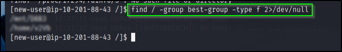
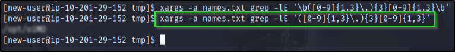
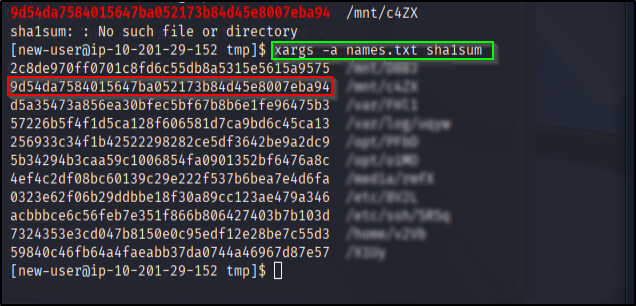
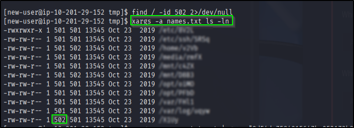

# 📝 Writeup – Ninja Skills (TryHackMe)

---
*First thing to do is save all the required file names in `name.txt`. Then we find their absolute path and save them in `names.txt`*   
```bash
xargs -a name.txt -d '\n' -I {} find / -name "{}" -type f
```    
`-I {}` each line from name.txt is substituted in {}

---
## 1. Best Group

```bash
find / -group best-group -type f 2>/dev/null
```       
`-type f` tells its a file type   
`2>/dev/null` ignores all *permission denied* warnings   
     

## 2. Contains IP   
```bash
xargs -a names.txt grep -lE '([0-9]{1,3}\.){3}[0-9]{1,3}'
```      
`xargs` takes each line from names.txt  
`-a` pass it as argument   
`-l` return the line that satisfies   
`-E` regex matching   
    

## 3. SHA1 Hash   
```bash
xargs -a names.txt sha1sum
```      
`sha1sum` converts file data to sha1 hash   
    

## 4. Word Count   
```bash
xargs -a names.txt wc -l
```      
`-l` returns no. of lines   

## 5/6. Owner of ID 502 / Permission  
```bash
xargs -a names.txt ls -ln
```    



